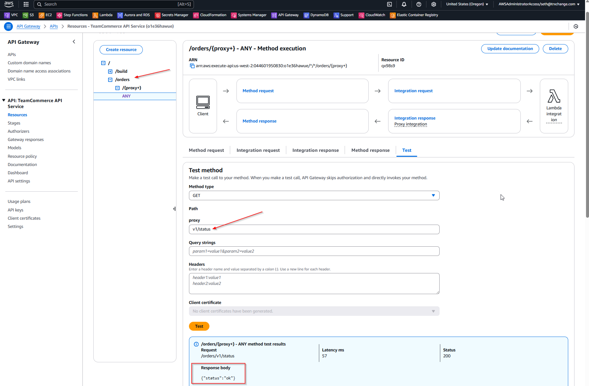
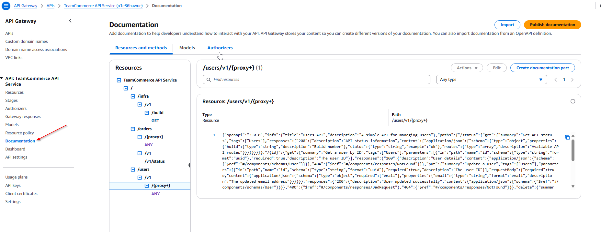

# Demo structure for team owned routes on API Gateway

This is a proof of concept inspired by this article:

**Architecting multiple microservices behind a single domain with Amazon API Gateway**
https://aws.amazon.com/blogs/compute/architecting-multiple-microservices-behind-a-single-domain-with-amazon-api-gateway/

Ideally, the organization would like to host all of its API under a single domain:

Example: https://api.orginzation.com/v1

The question is, can we create a organization-wide API Gateway and have different teams own different API paths separately, so that each team controls their own codebase and deploy independently.

In this demo, there are 2 different developer teams:

- Team A: owns the `/users` endpoint.
- Team B: owns the `/orders` endpoint.

The project folder looks like this:

```
├── infra
│   └── cdk
├── users
│   ├── README.md
│   ├── api
│   └── cdk
└── orders
    ├── README.md
    ├── api
    └── cdk
```

Each team is responsible for their own endpoint. Because of the way the CDK is structured, this project could technically be split into 3 separate repositories - infra / users / orders - to further isolate each module.

This project makes use of AWS CDK

https://docs.aws.amazon.com/cdk/api/v2/docs/aws-construct-library.html

The code behind the routes is using the lambda-api library.


## Infra CDK

This will launch the shell of an API Gateway named TeamCommerceApiGateway

The gateway will has a default GET method that will return the build number - at `/infra/v1/build`

To deploy:

```
cd infra/cdk
cp .env.example .env
cdk deploy
```

## Users CDK

The CDK stack will create a new proxy resource on the TeamCommerceApiGateway at `/users`

Adjust the `.env` file with version and path information

```
cd users/api
cp .env.example .env
```

Automatically generate OpenAPI 3.0 documentation

If this is run, a file named api/openapi.json will be created. 

This will automatically be added to the API Gateway Documentation!

```
npm run openapidocs
```


Deploy

```
cd users/cdk
cdk deploy
```

## Orders CDK

The CDK stack will create a new proxy resource on the TeamCommerceApiGateway at `/orders`

```
cd orders/cdk
cdk deploy
```

## MVC Architecture

The underlying framework uses the lambda-api library

https://github.com/jeremydaly/lambda-api

The MVC setup is demonstrated with the `api/index.mjs` file acting as a [front controller](https://www.tutorialspoint.com/design_pattern/front_controller_pattern.htm) to the application.

### Included classes

**UsersController.mjs**

The controller class acts as an adapter between the lambda-api library and the data models, simply a mechanism for transforming inputs.

**UsersModel.mjs**

A simple example of a model layer - this could be mysql / dynamodb / mongodb / etc.

**UsersMiddleware.mjs**

A simple middleware example to demonstrate how middleware can be used in lambda-api.

In the examples the middleware uses the VineJS validation library to do some simple validation on inputs to the different api routes.

## Tests

There are jest unit tests in each of the project folders.  

To run by hand:

```
cd users\api
npm run test -- --resetModules
```

A sample API test using the AWS Console.



Automated Documentation from by [swagger-jsdoc](https://github.com/Surnet/swagger-jsdoc)




---

NOTE: There is no security built into this yet.


