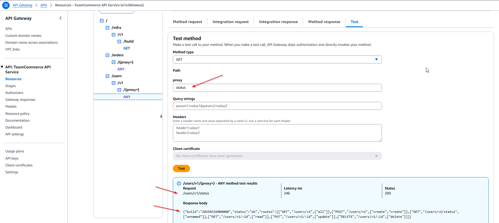

# Demo structure for team owned routes on API Gateway

This is a proof of concept inspired by this article:

**Architecting multiple microservices behind a single domain with Amazon API Gateway**
https://aws.amazon.com/blogs/compute/architecting-multiple-microservices-behind-a-single-domain-with-amazon-api-gateway/

Ideally, the organization would like to host all of its API under a single domain:

Example: https://api.organization.com/v1

The question is, can we create a organization-wide API Gateway and have different teams own different API paths separately, so that each team controls their own codebase and deploy independently.

In this demo, there are 2 different developer teams:

- Team A: owns the `/users` endpoint.
- Team B: owns the `/orders` endpoint.

The project folder looks like this:

```
├── infra
│   └── cdk
├── users
│   ├── README.md
│   ├── api
│   ├── layers/nodejs
│   └── cdk
└── orders
    ├── README.md
    ├── api
│   ├── layers/nodejs
    └── cdk
```

Each team is responsible for their own endpoint. Because of the way the CDK is structured, this project could technically be split into 3 separate repositories - infra / users / orders - to further isolate each module.

This project makes use of AWS CDK

https://docs.aws.amazon.com/cdk/api/v2/docs/aws-construct-library.html

The code behind the routes is using the lambda-api library.


## Infra CDK

This will launch the shell of an API Gateway named TeamCommerceApiGateway

The gateway will has a default GET method that will return the build number - at `/infra/v1/build`

To deploy:

```
cd infra/cdk
cp .env.example .env
cdk deploy
```

## Users CDK

The CDK stack will create a new proxy resource on the TeamCommerceApiGateway at `/users`

The example routes that are available are:

```
GET /status
GET /{id}
GET /
PUT /{id}
POST /
DELETE /{id}
```

Note the /status route will return the following information

```
{
    "build": "20250326000000",
    "status": "ok",
    "routes": [
        [
            "GET",
            "/users/v1",
            [
                "all"
            ]
        ],
        [
            "POST",
            "/users/v1",
            [
                "create",
                "create"
            ]
        ],
        [
            "GET",
            "/users/v1/status",
            [
                "unnamed"
            ]
        ],
        [
            "GET",
            "/users/v1/:id",
            [
                "read"
            ]
        ],
        [
            "PUT",
            "/users/v1/:id",
            [
                "update"
            ]
        ],
        [
            "DELETE",
            "/users/v1/:id",
            [
                "delete"
            ]
        ]
    ]
}
```

Adjust the `.env` file with version and path information

```
cd users/api
cp .env.example .env
```

Automatically generate OpenAPI 3.0 documentation

If this is run, a file named api/openapi.json will be created. 

This will automatically be added to the API Gateway Documentation!

```
npm run openapidocs
```


Deploy

```
cd users/cdk
cdk deploy
```

## Orders CDK

The CDK stack will create a new proxy resource on the TeamCommerceApiGateway at `/orders`

```
cd orders/cdk
cdk deploy
```

## Lambda Layers

In order to keep the api folders as slim as possible, a lambda layer is created in the CDK stack.

`jest.config.mjs` has modulePaths configured to use the packages installed in layers/nodejs.


## MVC Architecture

The underlying framework uses the lambda-api library

https://github.com/jeremydaly/lambda-api

The MVC setup is demonstrated with the `api/index.mjs` file acting as a [front controller](https://www.tutorialspoint.com/design_pattern/front_controller_pattern.htm) to the application.

### Included classes

**UsersController.mjs**

The controller class acts as an adapter between the lambda-api library and the data models, simply a mechanism for transforming inputs.

**UsersModel.mjs**

A simple example of a model layer - this could be mysql / dynamodb / mongodb / etc.

**UsersMiddleware.mjs**

A simple middleware example to demonstrate how middleware can be used in lambda-api.

In the examples the middleware uses the VineJS validation library to do some simple validation on inputs to the different api routes.

## Tests

There are jest unit tests in each of the project folders.  

To run by hand:

```
cd users\api
npm run test -- --resetModules
```

A sample API test using the AWS Console.



Automated Documentation from by [swagger-jsdoc](https://github.com/Surnet/swagger-jsdoc)


---

NOTE: There is no security built into this yet.

## Notes

Pros and cons of using the api gateway {proxy+} resource 

### Pros
1. **Simplified Routing**: The `{proxy+}` resource acts as a catch-all, forwarding all requests under a specific path to a backend service. This reduces the need to define individual routes for every endpoint, streamlining setup.
2. **Flexibility**: It allows the backend (e.g., Lambda or a custom server) to handle routing logic, making it ideal for dynamic or complex applications where paths might change frequently.
3. **Reduced Configuration Overhead**: You don’t need to manually map every possible HTTP method or path in the API Gateway, saving time and effort, especially for large APIs.
4. **Scalability**: API Gateway handles scaling automatically, and `{proxy+}` ensures all requests are efficiently passed to the backend without additional configuration as traffic grows.
5. **Integration with Serverless**: Works seamlessly with serverless architectures (e.g., AWS Lambda), letting the backend process requests without worrying about managing servers or detailed Gateway setup.

### Cons
1. **Less Granular Control**: By using `{proxy+}`, you offload routing logic to the backend, losing some of API Gateway’s ability to filter or transform requests at the gateway level (e.g., via custom mappings or policies).
2. **Increased Backend Responsibility**: The backend must handle all path parsing and validation, which could increase complexity or introduce errors if not implemented carefully.
3. **Security Risks**: Since `{proxy+}` forwards all requests (including malformed or unexpected ones), the backend must be robust enough to handle invalid inputs, or you risk exposing vulnerabilities.
4. **Debugging Challenges**: Troubleshooting can be harder because API Gateway logs might not provide detailed insights into specific paths or methods—everything is lumped under the proxy.
5. **Cost Considerations**: While simple to set up, API Gateway charges based on request volume, and `{proxy+}` might lead to higher costs if it forwards unnecessary or unfiltered traffic to the backend.

### Use Case Fit
- **Good For**: Rapid prototyping, serverless apps, or scenarios where the backend already has strong routing logic (e.g., an Express.js server or a prebuilt API).
- **Not Ideal For**: APIs requiring fine-tuned request validation, transformation, or throttling at the gateway level before hitting the backend.


